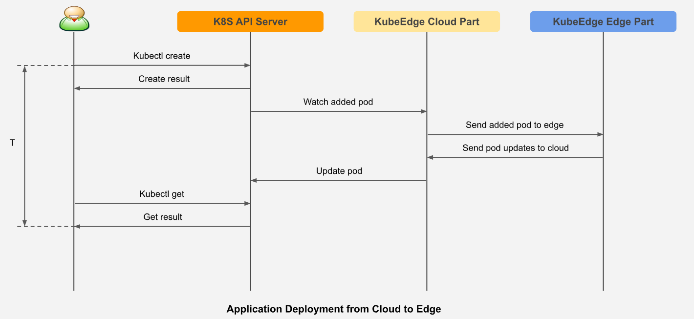

# ci-bot-test

KubeEdge is an open source system extending native containerized application orchestration and device management to hosts at the Edge. It is built upon Kubernetes and provides core infrastructure support for networking, application deployment and metadata synchronization between cloud and edge. It also supports **MQTT** and allows developers to author custom logic and enable resource constrained device communication at the Edge. KubeEdge consists of a cloud part and an edge part.
